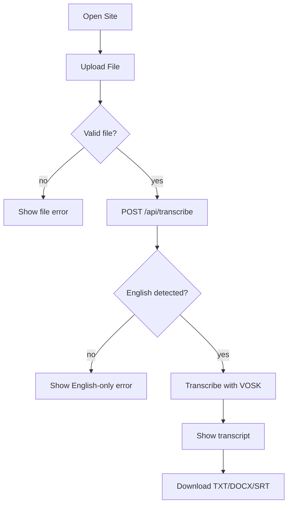

# User Flow

**Last Updated:** February 2026

## 1. Primary Flow (English File)

1. User opens the site
2. User uploads an audio/video file
3. Frontend validates file type and size
4. Frontend POSTs to `/api/transcribe`
5. Backend detects language (first 15 seconds)
6. If English, backend transcribes full file
7. Frontend displays transcript
8. User downloads TXT/DOCX/SRT

## 2. User Journey Diagram

## 3. Alternate Flows

### 3.1 Invalid File Type

- Frontend blocks upload
- Error message: `Unsupported file format. Please upload an audio or video file.`

### 3.2 File Too Large

- Frontend blocks upload
- Error message: `File size exceeds 200 MB limit`

### 3.3 Non-English File

- Backend returns language code with empty transcript
- Frontend shows:
  `Sorry: We currently support transcription in English only. We're actively working with the community to add 98+ other languages. Please click "Reset" and try again with an English recording.`

### 3.4 Backend Unreachable

- All endpoint candidates fail
- Frontend shows:
  `Unable to reach the transcription service. Check that the API is running and accessible.`

### 3.5 Transcription Failure

- Backend returns `500` or no transcript text
- Frontend shows:
  `Transcription failed. Please try again.`
  or
  `Transcription returned no text.`
